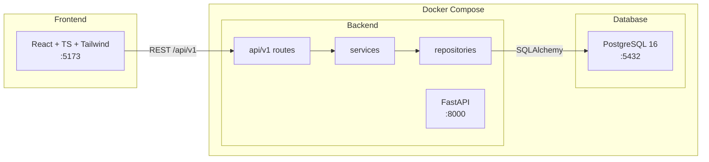
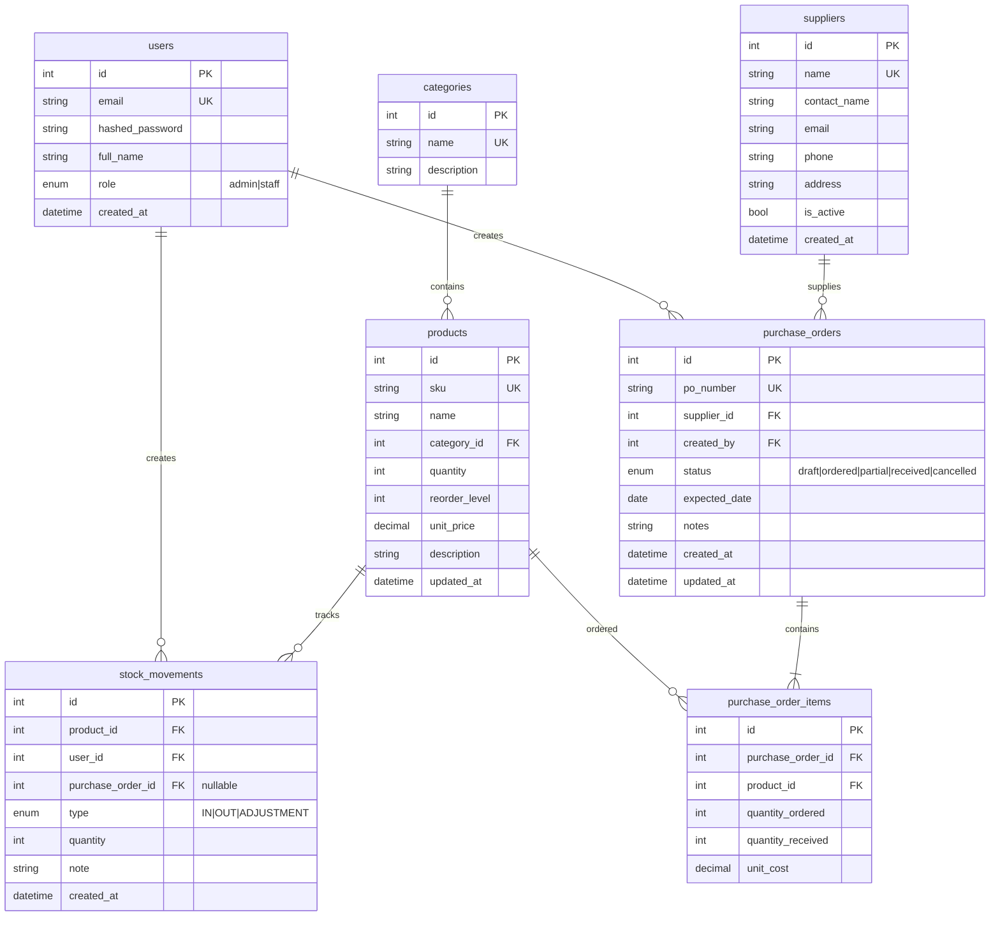
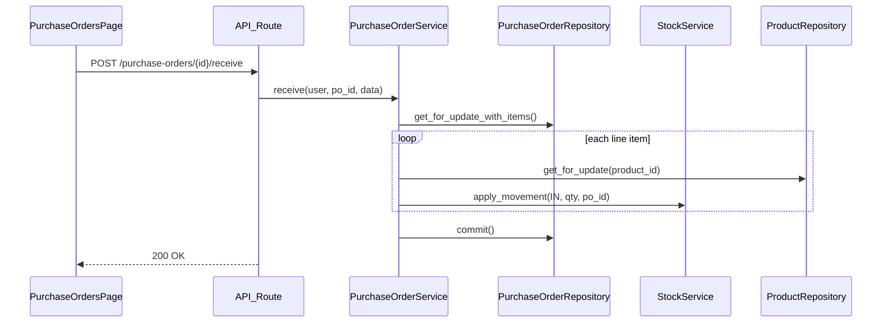

# Inventory Management System — Implementation Plan

**Status: Implemented.** All planned features and the repository-layer refactor are complete.

## Scope (delivered)

- **Auth:** Register/login with JWT; all inventory routes protected
- **Roles (RBAC):** `admin` and `staff` with permission boundaries
- **Core inventory:** Products, categories, stock levels, stock in/out/adjustment movements, low-stock alerts, dashboard
- **Suppliers:** Full CRUD for vendor records linked to purchase orders
- **Purchase orders:** Create PO with line items, status workflow, receive goods (auto stock IN)
- **Reports:** Inventory summary, low-stock report, movement history report, PO summary
- **CSV export:** Download reports as CSV from API endpoints
- **Docker:** One-command `docker compose up` for local dev
- **Backend architecture:** Routes → Services → Repositories (SOLID-aligned layering)

---

## Role permissions

| Action | admin | staff |
|--------|:-----:|:-----:|
| View dashboard, products, categories, movements | yes | yes |
| Create/edit/delete products & categories | yes | yes |
| Manual stock movements (IN/OUT/ADJUSTMENT) | yes | yes |
| View suppliers | yes | yes |
| Create/edit/delete suppliers | yes | no |
| Create/edit purchase orders | yes | yes |
| Receive / cancel purchase orders | yes | no |
| View reports & export CSV | yes | yes |
| Manage users / change roles | yes | no |
| Delete purchase orders (draft only) | yes | no |

Enforced via FastAPI `require_admin` on restricted routes; frontend hides/disables UI for unauthorized actions.

---

## Architecture



| Service | Tech | Port |
|---------|------|------|
| `frontend` | Vite + React 18 + TypeScript + Tailwind | 5173 |
| `backend` | FastAPI + SQLAlchemy 2 + Alembic + Pydantic v2 | 8000 |
| `db` | PostgreSQL 16 | 5432 |

### Backend layering

| Layer | Path | Responsibility |
|-------|------|----------------|
| Routes | [`backend/app/api/v1/`](backend/app/api/v1/) | HTTP only; no `db.query()` |
| Services | [`backend/app/services/`](backend/app/services/) | Business rules; raise domain exceptions |
| Repositories | [`backend/app/repositories/`](backend/app/repositories/) | All SQLAlchemy queries |
| Models | [`backend/app/models/`](backend/app/models/) | DB entities |
| Schemas | [`backend/app/schemas/`](backend/app/schemas/) | Pydantic DTOs |
| Core | [`backend/app/core/`](backend/app/core/) | Config, security, deps (DI), exceptions, pagination |

**DI wiring:** [`backend/app/core/deps.py`](backend/app/core/deps.py) provides `get_*_repo()` and `get_*_service()` factories via FastAPI `Depends`.

**Error handling:** Services raise `DomainError` subclasses from [`backend/app/core/exceptions.py`](backend/app/core/exceptions.py); [`backend/app/main.py`](backend/app/main.py) maps them to JSON HTTP responses.

---

## Repository layout

```
IMS/
├── docker-compose.yml
├── .env.example
├── .gitignore
├── README.md
├── backend/
│   ├── Dockerfile
│   ├── entrypoint.sh
│   ├── requirements.txt
│   ├── alembic/
│   └── app/
│       ├── main.py
│       ├── seed.py
│       ├── core/              # config, security, deps, exceptions, pagination
│       ├── models/
│       ├── schemas/
│       ├── repositories/      # data access (one per aggregate)
│       ├── services/          # business logic (instance classes + DI)
│       └── api/v1/            # thin HTTP handlers
└── frontend/
    ├── Dockerfile
    ├── package.json
    └── src/
        ├── api/
        ├── components/
        ├── context/           # AuthContext with role
        ├── pages/
        └── types/
```

### Repositories (implemented)

| Repository | Key methods |
|------------|-------------|
| `UserRepository` | `get_by_email`, `list_all` |
| `CategoryRepository` | `get_by_name`, `list_all`, `count` |
| `ProductRepository` | `list_paginated`, `list_low_stock`, `get_for_update`, `count_low_stock` |
| `SupplierRepository` | `get_by_name`, `list_all`, `count` |
| `PurchaseOrderRepository` | `get_by_id_with_details`, `get_for_update_with_items`, `list_paginated`, `count_open` |
| `StockMovementRepository` | `list_paginated`, `list_for_report`, `list_recent` |

### Services (implemented)

| Service | Responsibility |
|---------|----------------|
| `AuthService` | Register, authenticate, token, user role management |
| `CategoryService` | Category CRUD |
| `ProductService` | Product CRUD + pagination + low-stock |
| `SupplierService` | Supplier CRUD |
| `StockService` | Transactional stock movements (IN/OUT/ADJUSTMENT) |
| `PurchaseOrderService` | PO lifecycle (draft → ordered → partial/received) + receive |
| `DashboardService` | Dashboard summary aggregates |
| `ReportService` | Report queries + CSV generation |

---

## Database schema



**Stock rules:**
- Manual `IN` / `OUT` / `ADJUSTMENT` via stock-movements API (staff + admin)
- PO **receive** creates `IN` movements per line item and updates `products.quantity` atomically
- `OUT` rejects insufficient stock; `ADJUSTMENT` sets absolute quantity
- `purchase_order_id` on movements links auto-IN from PO receiving

**PO status workflow:**
- `draft` → `ordered` (staff/admin can submit)
- `ordered` → `partial` or `received` on receive (admin only for receive)
- `draft` → `cancelled` (admin only)
- Cannot edit line items once status is `received` or `cancelled`

---

## API surface (`/api/v1`)

**Auth**
| Method | Endpoint | Purpose |
|--------|----------|---------|
| POST | `/auth/register` | Create user (default role: `staff`) |
| POST | `/auth/login` | Return JWT (includes role claim) |
| GET | `/auth/me` | Current user + role |
| GET | `/auth/users` | List users (admin) |
| PATCH | `/auth/users/{id}/role` | Change role (admin) |

**Inventory**
| Method | Endpoint | Purpose |
|--------|----------|---------|
| CRUD | `/categories` | Category management |
| CRUD | `/products` | Product CRUD + search/filter/pagination |
| GET | `/products/low-stock` | Products at/below reorder level |
| POST | `/stock-movements` | Record IN/OUT/ADJUSTMENT |
| GET | `/stock-movements` | Paginated history (filter by product, type, date) |

**Suppliers** (create/update/delete: admin only)
| Method | Endpoint | Purpose |
|--------|----------|---------|
| CRUD | `/suppliers` | Supplier management |

**Purchase orders**
| Method | Endpoint | Purpose | Role |
|--------|----------|---------|------|
| GET/POST | `/purchase-orders` | List / create PO | staff+ |
| GET/PATCH | `/purchase-orders/{id}` | Detail / update draft PO | staff+ |
| POST | `/purchase-orders/{id}/submit` | draft → ordered | staff+ |
| POST | `/purchase-orders/{id}/receive` | Receive items, stock IN | admin |
| POST | `/purchase-orders/{id}/cancel` | Cancel PO | admin |
| DELETE | `/purchase-orders/{id}` | Delete draft PO | admin |

**Dashboard & reports**
| Method | Endpoint | Purpose |
|--------|----------|---------|
| GET | `/dashboard/summary` | Totals, low-stock count, recent movements, open POs |
| GET | `/reports/inventory` | Full inventory snapshot (JSON) |
| GET | `/reports/inventory/export` | CSV download |
| GET | `/reports/low-stock` | Low-stock items (JSON) |
| GET | `/reports/low-stock/export` | CSV download |
| GET | `/reports/movements` | Movement history with date filters (JSON) |
| GET | `/reports/movements/export` | CSV download |
| GET | `/reports/purchase-orders` | PO summary with status filters (JSON) |
| GET | `/reports/purchase-orders/export` | CSV download |

### Seed data ([`backend/app/seed.py`](backend/app/seed.py))
- Admin: `admin@ims.local` / `admin123`
- Staff: `staff@ims.local` / `staff123`
- Sample categories, products, suppliers, one draft PO

---

## Frontend (React + TypeScript + Tailwind)

### Tooling
- Vite, React Router v6, TanStack Query, Axios (JWT interceptors)
- Tailwind admin layout (sidebar + top bar)

### Pages

| Route | Page | Features |
|-------|------|----------|
| `/login` | Login | Email/password |
| `/register` | Register | Creates staff account |
| `/` | Dashboard | Stats, low-stock, recent movements, open POs |
| `/products` | Products | CRUD table, search, stock badges |
| `/categories` | Categories | CRUD list |
| `/movements` | Stock Movements | Record form + filtered history |
| `/suppliers` | Suppliers | CRUD (admin: full; staff: read-only) |
| `/purchase-orders` | Purchase Orders | List, create/edit draft, submit, receive (admin), detail view |
| `/reports` | Reports | Tabs per report type, date filters, Export CSV |
| `/users` | User Management | Admin only: list users, change roles |

---

## Data flow: receive purchase order



---

## Docker Compose

3 services (`db`, `backend`, `frontend`) with healthcheck, hot reload, and `VITE_API_URL`.

```bash
docker compose up --build
```

---

## Verification checklist

- [x] Full stack scaffolded (backend, frontend, Docker)
- [x] JWT auth + admin/staff RBAC
- [x] Products, categories, suppliers, POs, movements, reports
- [x] Repository + service layering with DI
- [x] Domain exceptions mapped to HTTP responses
- [x] Seed data (admin + staff demo accounts)
- [ ] `docker compose up --build` E2E smoke test (run locally with Docker Desktop)

**Manual E2E checks:**
- Login as admin and staff; JWT includes role
- Staff cannot create suppliers or receive POs (403)
- Admin can manage suppliers, receive POs, change user roles
- Create supplier → create PO → submit → receive → product quantity increases
- Manual OUT movement fails on insufficient stock
- Reports return correct data; CSV exports download valid files
